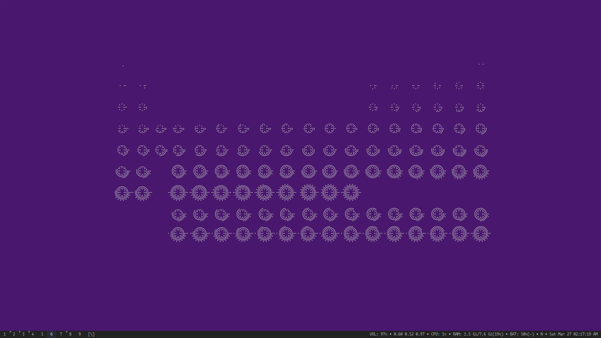

# [rsapkf/777]

This repository contains my dotfiles for:

- [Neovim](https://github.com/neovim/neovim) - Text editor
- [Alacritty](https://github.com/jwilm/alacritty) - Terminal emulator
- [tmux](https://github.com/tmux/tmux) - Terminal multiplexer
- [Bash](https://www.gnu.org/software/bash) - Shell
- [Zsh](https://sourceforge.net/p/zsh/code/ci/master/tree) - Shell
- [Oh My Zsh](https://github.com/robbyrussell/oh-my-zsh) - Framework for managing Zsh
- [sxhkd](https://github.com/baskerville/sxhkd) - Simple X hotkey daemon
- [Rofi](https://github.com/davatorium/rofi) - Program launcher
- [Newsboat](https://github.com/newsboat/newsboat) - RSS/Atom feed reader
- [zathura](https://github.com/pwmt/zathura) - Document viewer
- [NeoMutt](https://github.com/neomutt/neomutt) - Email client
- [htop](https://github.com/hishamhm/htop) - Interactive process viewer
- [ranger](https://github.com/ranger/ranger) - File browser
- [Irssi](https://github.com/irssi/irssi) - IRC client
- [WeeChat](https://github.com/weechat/weechat) - Chat client
- [qutebrowser](https://github.com/qutebrowser/qutebrowser) - Keyboard-driven Vim-like browser
- [Neofetch](https://github.com/dylanaraps/neofetch) - System info script
- [Compton](https://github.com/chjj/compton) - Composite manager
- [Conky](https://github.com/brndnmtthws/conky) - System monitor

The `.suckless` directory contains my builds of suckless tools including all the patches.

- [dwm](https://git.suckless.org) - Dynamic window manager
- [slstatus](https://git.suckless.org) - Status bar for dwm
- [st](https://git.suckless.org/) - Simple terminal emulator
- [dmenu](https://git.suckless.org) - Dynamic menu for X
- [slock](https://git.suckless.org) - Simple X display locker
- [surf](https://git.suckless.org) - Simple web browser
- [tabbed](https://git.suckless.org) - Simple generic tabbed frontend to xembed-aware applications
- [sent](https://git.suckless.org) - Simple plaintext presentation tool
- [dwmstatus](https://git.suckless.org) - Status bar for dwm

I sparsely use these tools now. The config files are here for reference:

- [fish](https://github.com/fish-shell/fish-shell) - Shell
- [Vim](https://github.com/vim/vim) - Text editor
- [Emacs](https://www.gnu.org/software/emacs) - Text editor
- [xmonad](https://github.com/xmonad/xmonad) - Window manager
- [Xmobar](https://github.com/jaor/xmobar) - Status bar for xmonad
- [i3](https://github.com/i3/i3) - Window manager
- [i3-gaps](https://github.com/Airblader/i3) - i3 with more features
- [bspwm](https://github.com/baskerville/bspwm) - Window manager
- [Polybar](https://github.com/polybar/polybar) - Status bar
- [i3blocks](https://github.com/vivien/i3blocks) - Status bar
- [rxvt-unicode](http://software.schmorp.de/pkg/rxvt-unicode.html) - Terminal emulator
- [Termite](https://github.com/thestinger/termite) - Terminal emulator `deprecated`

## Managing dotfiles

Currently, I use a [bare git repository](https://news.ycombinator.com/item?id=11070797) in my home directory to track my dotfiles (detailed guide [here](https://www.atlassian.com/git/tutorials/dotfiles)). In the past I used [GNU Stow](https://www.gnu.org/software/stow/manual/stow.html) to do so.
